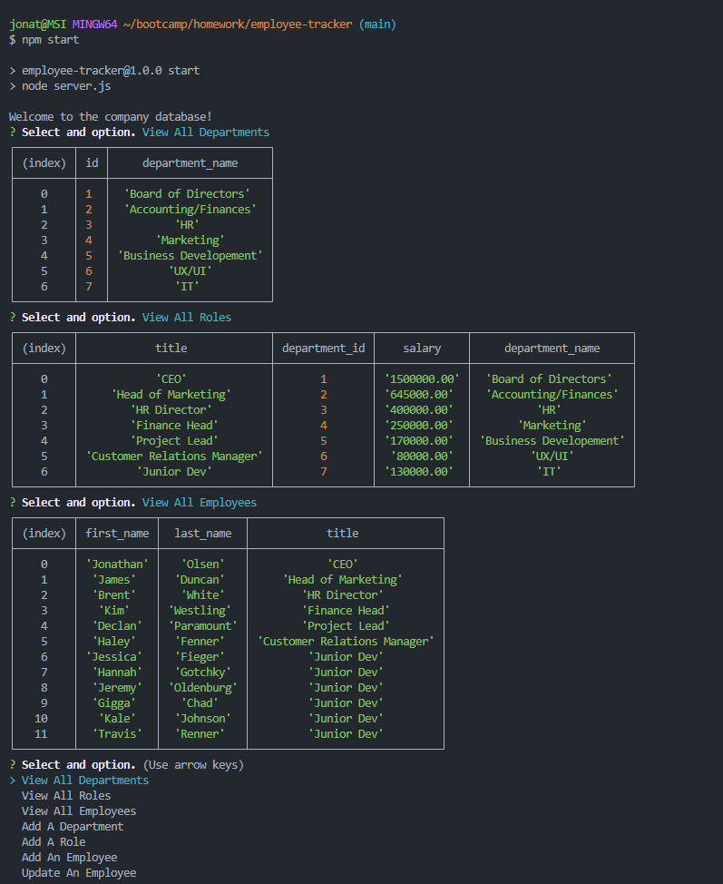

# Employee Database Tracker

## Description
This application is a CLI content management system for managing a company's employee database. The user can view departments, employees and the role to which each emplyee belongs. They can also add new items to each of the aformentioned sections as well as update existing employees. During the process of building this project, I gained a very intimate knowledge of how querying a database is performed. This was by far the most challenging project I have worked on thus far, but happy to say that I've finally completed it.

## Usage
-Once the files have been imported, open your desired CLI.
-Run <npm i> to install neccessary node packages.
-Use command <npm start> to initiate the program.
-Choose your desired functionality from the list.

## Screenshot

## Repository Link
https://github.com/jonathanjjolsen/employee-tracker

## Video Walkthrough Link
https://drive.google.com/file/d/15xvNCeVzPntg6dcq11yN6oquwcXIojwm/view